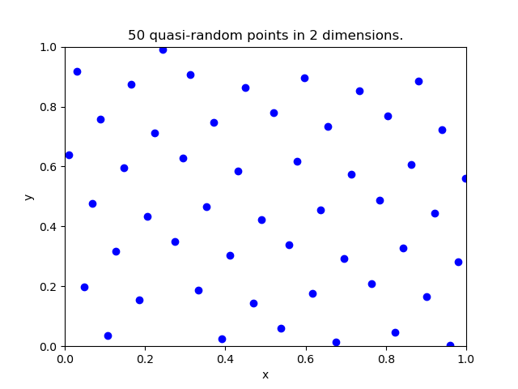
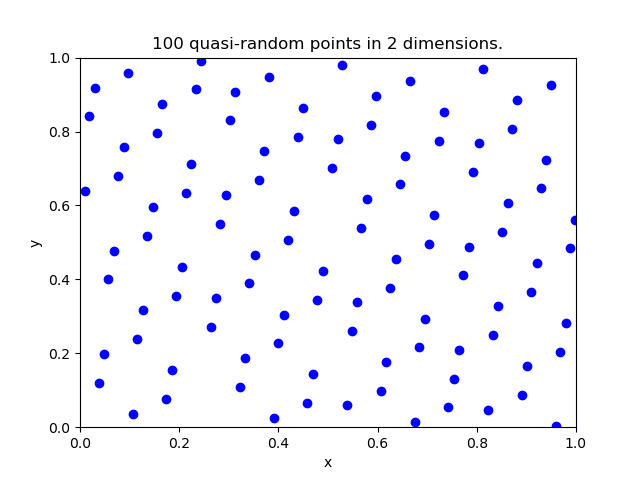
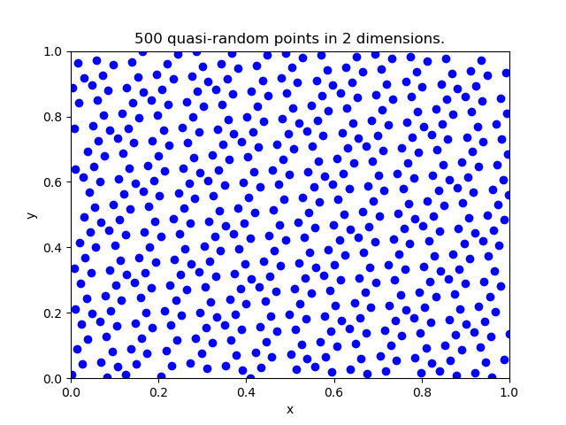
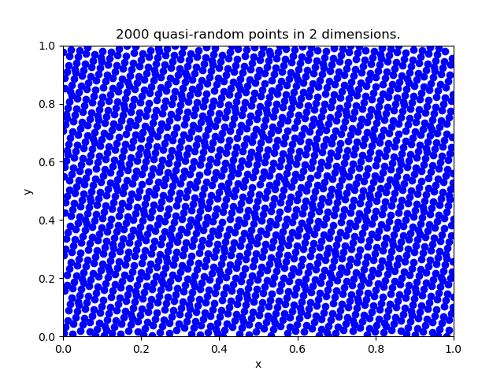
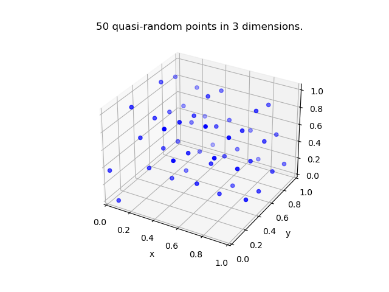
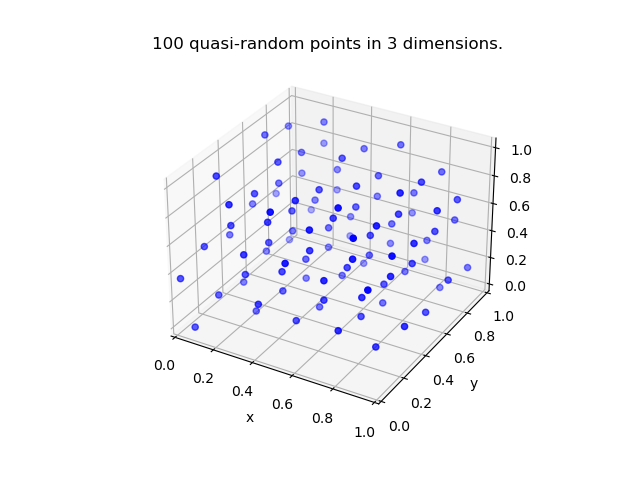
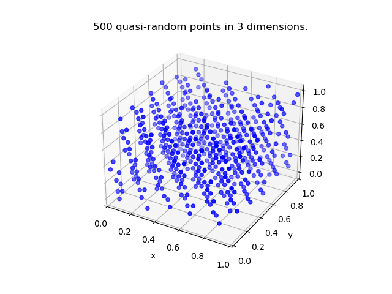
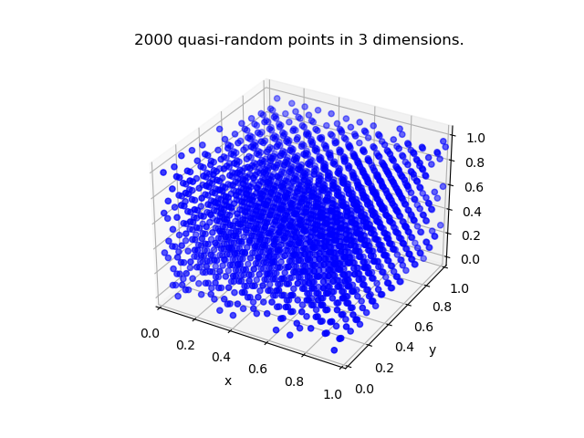

## Quasi-random number generator

A simple quasi-random number generator implementation in C++ for generating low-discrepancy sequences. It generates points in any number of dimensions on a unit hypercube.  
This generator is based on:  
Martin Roberts, 2018. "[The Unreasonable Effectiveness of Quasirandom Sequences](http://extremelearning.com.au/unreasonable-effectiveness-of-quasirandom-sequences/)" 
 

### Plots showing some generated sequences
 

#### 
2-dimensions

|   	|   	|
|           ---	            |           ---	            |
|   	|   	|

#### 
3-dimensions

|   	|   	|
|           ---	            |           ---	            |
|   	|   	|